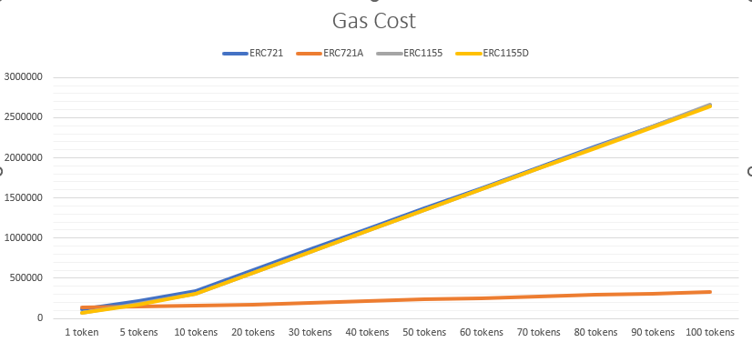
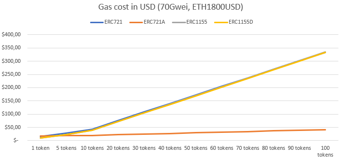
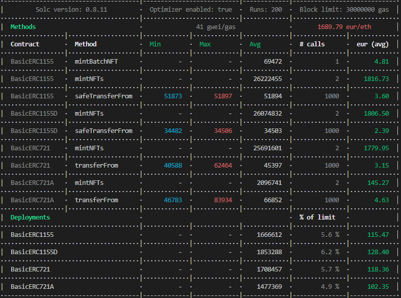

# NFT minting gas cost comparison.

Comparison of gas costs and their evolution for different ERC standards that can be used to make an NFT contract.
- ERC721, implementation by Openzeppelin. By far the most used, it is not the cheapest gas-cost wise but it comes with some good tradeoffs like readability, simplicity and the fact that they have been going around enough time that you can consider them one of the safest implementations.[More Info](https://docs.openzeppelin.com/contracts/4.x/erc721) [Github Repo](https://github.com/OpenZeppelin/openzeppelin-contracts/blob/master/contracts/token/ERC721/ERC721.sol)
- ERC721A, implementation by Chiru Labs and used first in the Azuki collection. It has been making a lot of noise lately and for good reason, its perfomance for batch minting is by far the best in the comparison, except for minting a single NFT. As a tradeoff, the transfer of tokens are more expensive than with Openzeppelin's implementation.[More Info](https://www.azuki.com/erc721a) [Github Repo](https://github.com/chiru-labs/ERC721A/blob/main/contracts/ERC721A.sol)
- ERC1155 by Openzeppelin. Technically the "semi-fungible" standard, you can force its behaviour to be like an ERC721. Each mint creates a 1/1 token, effectively making it an NFT. It is more cost efficient than ERC721, but less than ERC721A. [More Info](https://docs.openzeppelin.com/contracts/4.x/erc1155) [Github Repo](https://github.com/OpenZeppelin/openzeppelin-contracts/blob/master/contracts/token/ERC1155/ERC1155.sol)
- ERC1155D by DonkeyVerse. Interesting implementation for 1/1 editions. Not as efficient with batch minting but an interesting implementation. You will notice that the article in the link claims that it can achieve a mint cost of 51072. This is indeed true if the optimizer is set to 10.000 and the index tracking is optimized within the loop. I decided not to make these optimizations so we can test all the contracts with the same conditions. Even so, it is still the most efficient by far with token transfers. [More Info](https://medium.com/donkeverse/introducing-erc1155d-the-most-efficient-non-fungible-token-contract-in-existence-c1d0a62e30f1) [Github Repo](https://github.com/DonkeVerse/ERC1155D/blob/main/contracts/ERC1155D.sol)

I used the gas report from [hardhat-gas-reporter](https://www.npmjs.com/package/hardhat-gas-reporter), just download the repo, set the number of tokens to be minted in the test.js file (line 17) and then use ````npx hardhat test```` 

Gas cost evolution (in gas points)


Gas Cost evolution, assuming 50 Gwei and an ETH price of 1800USD


Bonus Track: if you ever want to mint 1000 tokens, choose your standard wisely


## Future work
Make all the ERC1155D index optimizations and set the optimizer to 10.000, so we can test ERC1155D in its best conditions in equality with the rest of standards.
